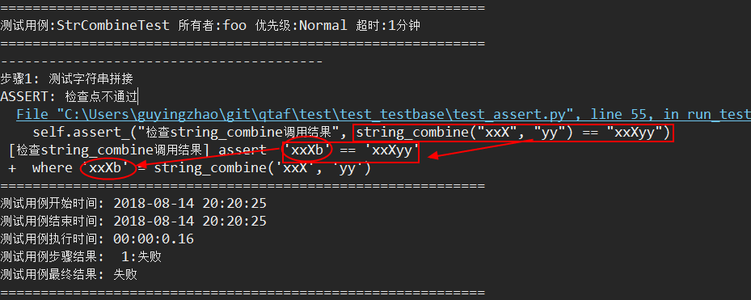

检查测试用例
==============

==============
用例测试断言
==============

.. warning:: qtaf的新版本，提供了新的断言函数assert\_，推荐使用新接口编写用例，assert_equal和assert_match函数建议减少使用。

在测试用例的执行过程中，往往需要设置一些检查点，用于判断用例执行是否符合预期。下面将介绍如何使用断言。

假设我们需要测试一个字符串拼接的函数::

   def string_combine(a,b):
       return a+b
      
测试用例的代码如下::

   from testbase.testcase import TestCase

   class StrCombineTest(TestCase):
       '''测试字符串拼接接口
       '''
       owner = "foo"
       status = TestCase.EnumStatus.Ready
       priority = TestCase.EnumPriority.Normal
       timeout = 1
   
       def run_test(self):
           #---------------------------
           self.start_step("测试字符串拼接")
           #---------------------------
           result = string_combine("xxX", "yy")
           self.assert_("检查string_combine调用结果", result == "xxXyy")
      
以上的代码执行结果如下::

   ============================================================
   测试用例:StrCombineTest 所有者:foo 优先级:Normal 超时:1分钟
   ============================================================
   ----------------------------------------
   步骤1: 测试字符串拼接
   ============================================================
   测试用例开始时间: 2016-02-02 14:10:21
   测试用例结束时间: 2016-02-02 14:10:21
   测试用例执行时间: 00:00:0.00
   测试用例步骤结果:  1:通过
   测试用例最终结果: 通过
   ============================================================
   
可以看到结果是测试通过的，但是如果string_combine实现有问题，比如我们新定义一个string_combine::

   def string_combine(a,b):
       return a +'b'
      
因为以上的实现是有问题，执行结果必然是不通过的::

   ============================================================
   测试用例:StrCombineTest 所有者:foo 优先级:Normal 超时:1分钟
   ============================================================
   ----------------------------------------
   步骤1: 测试字符串拼接
   ASSERT: 检查点不通过:
     File "D:\Guying\Workspace\DemoProj\test_assert.py", line 22, in run_test
       self.assert_("检查string_combine调用结果", result == "xxXyy")
    [检查string_combine调用结果] assert  'xxXb' == 'xxXyy'
   ============================================================
   测试用例开始时间: 2018-08-27 17:00:30
   测试用例结束时间: 2018-08-27 17:00:31
   测试用例执行时间: 00:00:0.06
   测试用例步骤结果:  1:失败
   测试用例最终结果: 失败
   ============================================================
   
可以看到除了测试不通过外，测试结果还显示了断言失败的代码位置，断言失败的提示信息，以及实际进行断言测试的表达式。

这个就是QTA提供的测试断言的函数接口，其详细的定义如下::

   class TestCase(object):
   
      def assert_(self, message, value):
      '''断言一个值，为False则测试用例失败
        
      :param message: 断言失败时的提示信息
      :param value: 目标值，可以是任何bool结果的表达式或者值，推荐使用表达式
      :return: True or False
      '''

qtaf从框架层面，提供了assert_断言测试的堆栈信息展示，使用配置项QTAF_REWRITE_ASSERT来控制是否开启，默认是开启的，
在这种情况下，我们可以更加简洁地书写测试断言了，例如我们把原本用例的断言部分整合为一条语句，修改为如下::

   self.assert_("检查string_combine调用结果", string_combine("xxX", "yy") == "xxXyy")
        
      
那么实际的得到的结果输出如下：

   
可以看到，堆栈中对应的代码行就是我们书写的那条assert语句，接下来是assert的中间步骤详情：

   * 堆栈后续的第一行是断言失败时的提示信息，后面是"assert" + "'xxxXb' == 'xxXyy'"(实际值表达式);
   * 后续的行是对第一行实际表达式的值的跟踪，这里的表述意思是， 'xxxXb'是由调用 string_combine('xxX', 'yy')得到的
   
综上，有了assert_的中间步骤堆栈，我们可以很容易地知道，断言失败是由于string_combine函数调用结果是不正确，不仅代码书写上简单，定位问题速度也更快。

================
断言失败后置动作
================

QTA测试用例的代码的执行控制逻辑和一般Python的代码是类似的，所以除了执行过程中出现Python异常或用例执行超时，测试用例会一直执行，即使是assert_和wait_for系列的接口失败了，也会继续执行，比如下面的例子::

   from testbase.testcase import TestCase
       
   class FlowAfterAssertFailureTest(TestCase):
       '''流程控制测试
       '''
       owner = "foo"
       status = TestCase.EnumStatus.Ready
       priority = TestCase.EnumPriority.Normal
       timeout = 1
       
       def run_test(self):
           #---------------------------
           self.start_step("用例断言失败")
           #---------------------------
           self.assert_("断言失败", False)
           
           #---------------------------
           self.start_step("断言失败后置步骤")
           #---------------------------
           self.log_info("hello")

上面的第一个测试步骤中，前面一个步骤的断言是必然失败的，但是它不会终止后续步骤执行::

   ============================================================
   测试用例:FlowAfterAssertFailureTest 所有者:foo 优先级:Normal 超时:1分钟
   ============================================================
   ----------------------------------------
   步骤1: 用例断言失败
   ASSERT: 检查点不通过:
     File "D:\Guying\Workspace\DemoProj\test_assert.py", line 17, in run_test
       self.assert_("断言失败", False)
    [断言失败] assert  False
   ----------------------------------------
   步骤2: 断言失败后置步骤
   INFO: hello
   ============================================================
   测试用例开始时间: 2018-08-27 17:03:28
   测试用例结束时间: 2018-08-27 17:03:28
   测试用例执行时间: 00:00:0.06
   测试用例步骤结果:  1:失败 2:通过
   测试用例最终结果: 失败
   ============================================================

.. note:: 对于断言失败的执行逻辑处理，这个是QTA测试框架和其他一般测试框架比较大的差异点，设计测试用例是需要注意。

                       
========
重试机制
========

.. note:: 对于需要重试的场景，用户都应该使用testbase提供的Retry对象来实现，而不是自己去实现整个重试过程。

对于某些过程，我们可能无法一次性准确保证操作结果符合我们的预期，可能需要通过重试来提高稳定性。
例如，一个表单的UI界面，如果点击“提交”后，我们需要检查“提交”按钮变为不可点击的状态，测试用例可能是这样的::

   form.controls['提交按钮'].click()
   self.assert_("检查“提交”按钮变为不可点击的状态", form.controls['提交按钮'].enable == False)
   
这种写法存在的问题是，点击后，到执行assert_断言的时间极短，甚至图标还没有切换到不可点击状态，会导致断言结果不是我们预期的。
因此，我们可能会采取等待一定时间片，然后不断重试的方式::

   form.controls['提交按钮'].click()
   start = time.time()
   while time.time()-start > 2:
      if not form.controls['提交按钮'].enable:
         break
      else:
         time.sleep(0.2)
   else:
      raise RuntimeError("等待超过2秒还是可以点击")
      
按照上面的实现方式，只要2s内，按钮变成不可点击状态，那么就认为符合预期，因为如果2s后仍然没有切换成不可点击状态，实际上按钮就很可能确实没有切换过去。

还有另一种情况的重试，就是操作的过程耗时比较长，我们更希望按次数去重试，而不是按时间片。例如请求一个网址，由于网络不稳定，我们可能需要重试几次
才能稳定地获取到数据，这个非常简单，使用一个for循环即可。

针对重试，QTAF提供了一个统一的重试机制，同时支持两种场景，便于用户使用重试机制，示例代码如下::

   from testbase.retry import Retry
   for item in Retry(timeout=2, interval=0.5):
       print(item)
       
得到的输出如下::

   <_RetryItem iter=1, ts=1535363022.06>
   <_RetryItem iter=2, ts=1535363022.56>
   <_RetryItem iter=3, ts=1535363023.06>
   <_RetryItem iter=4, ts=1535363023.56>
   Traceback (most recent call last):
     File "D:\Guying\Workspace\DemoProj\test_assert.py", line 5, in <module>
       for item in Retry(timeout=2, interval=0.5):
     File "C:\Users\foo\git\qtaf\testbase\retry.py", line 54, in next
       raise RetryLimitExcceeded("funtion retried %s times in %ss" % (self.__count, self.timeout))
   testbase.retry.RetryLimitExcceeded: function retried 4 times in 2s

上面代码中，我们没有在对应时间内跳出循环，最后重试超出了限制，会抛出RetryLimitExcceeded的异常，我们也可以在构造Retry的时候指定raise_error=False，
这样也不会抛出RetryLimitExcceeded异常。如果我们的代码提前使用break跳出循环，则认为整个重试过程是成功的，不会抛出异常，例如::

   from testbase.retry import Retry
   for item in Retry(timeout=2, interval=0.5):
       break

迭代中，每个item包含两个属性，iteration迭代次数，ts迭代开始的时间戳，如果在迭代中有需要，可以使用这两个属性。
Retry的默认参数是tiemout=10，interval=0.5，使用最大的重试时间来重试。如果指定了limit，则会按照最大重试次数来进行重试，每次重试之间会间隔interval的时间::

   from testbase.retry import Retry
   for item in Retry(limit=3, interval=0.5):
       print(item)
     
输出结果如下::

   <_RetryItem iter=1, ts=1535363744.68>
   <_RetryItem iter=2, ts=1535363745.18>
   <_RetryItem iter=3, ts=1535363745.68>
   Traceback (most recent call last):
     File "D:\Guying\Workspace\DemoProj\test_assert.py", line 4, in <module>
       for item in Retry(limit=3, interval=0.5):
     File "C:\Users\foo\git\qtaf\testbase\retry.py", line 78, in next
       raise RetryLimitExcceeded("function retried for %s times" % self.limit)
   testbase.retry.RetryLimitExcceeded: function retried for 3 times
   
类似地，如果在重试次数用完之前，就跳出了循环，也不会抛出RetryLimitExcceeded异常。在了解testbase的重试机制后，我们针对UI按钮的检查代码就可以写成::

   for _ in Retry(timeout=2, raise_error=False):
       if not form.controls['提交按钮'].enable:
           break
   else:
       self.assert_("按钮没有变为不可点击状态", form.controls['提交按钮'].enable == False)

可以看出，这样写起来就会简洁很多。如果一个目标函数调用在成功的情况下会返回一个bool判定为True的结果，可以直接调用Retry对象的call方法::

   result = Retry(limit=2, interval=0.5).call(getattr, (form.controls['提交按钮'], "enable"))
   
如上，如果符合我们预期，那么result的值会等于True，否则，会抛出RetryLimitExcceeded异常。

=============
忙等待检查
=============

在讲解重试机制的时候，我们已经提到了，对于UI操作的检查可以通过Retry来进行检查，testbase提供了wait_for_equal和wait_for_match，
它内部使用到了Retry，用于实现我们所需要的忙等待检查功能，书写可以进一步简化::

   form.controls['提交按钮'].click()
   self.wait_for_equal("检查提交按钮变为不可点击", form.controls['提交按钮'], "enable", False, timeout=2, interval=0.2)
   
如果在2s内，form.controls['提交按钮'].enable没有变成False，那么最终用例失败，跟assert_类似，wait_for系列接口失败，用例仍然会继续执行。

